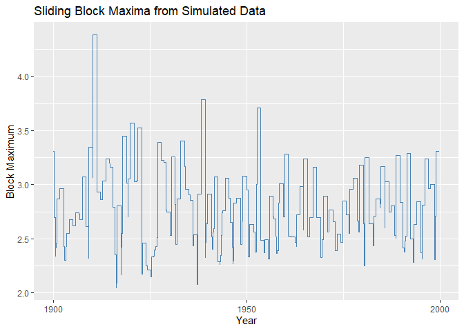
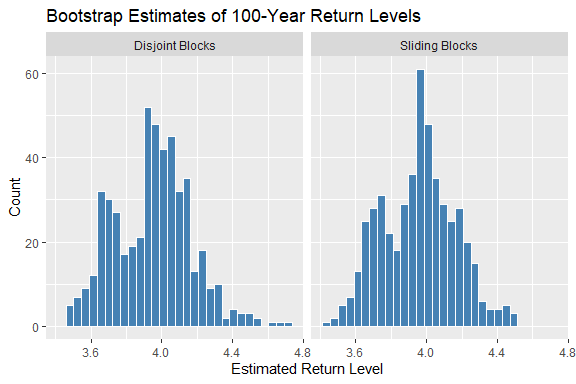

<!-- README.md is generated from README.Rmd. Please edit that file1 -->

# Welcome to maxbootR

[](https://CRAN.R-project.org/package=maxbootR)
[](https://github.com/torbenstaud/maxbootR/graphs/commit-activity)
[](https://github.com/torbenstaud/maxbootR/commits/master)
[](https://app.codecov.io/gh/torbenstaud/maxbootR)
[](https://torbenstaud.github.io/maxbootR/)
[](https://github.com/torbenstaud/maxbootR/actions/workflows/R-CMD-check.yaml)
[](https://lifecycle.r-lib.org/articles/stages.html)
[](https://www.gnu.org/licenses/gpl-3.0)
[](https://arxiv.org/abs/2409.05529)

The `maxbootR` package provides **fast and consistent bootstrap methods
for block maxima**, designed for applications in extreme value
statistics. Under the hood, performance-critical parts are implemented
in C++ via Rcpp, enabling efficient computation even for long time
series.

These methods are based on the first consistent bootstrap approach for
block maxima as introduced in [Bücher & Staud (2024+): Bootstrapping
Estimators based on the Block Maxima
Method.](https://arxiv.org/abs/2409.05529).

## Installation

You can install the development version of `maxbootR` from
[GitHub](https://github.com/) with:

``` r
# install.packages("devtools")
devtools::install_github("torbenstaud/maxbootR")
```

or from the official CRAN repository in `R` with:

``` r
install.packages("maxbootR")
```

## Quick Example

The following example demonstrates how to extract **sliding block
maxima** from synthetic data.

``` r
library(ggplot2)
library(maxbootR)
library(dplyr)
#> 
#> Attache Paket: 'dplyr'
#> Die folgenden Objekte sind maskiert von 'package:stats':
#> 
#>     filter, lag
#> Die folgenden Objekte sind maskiert von 'package:base':
#> 
#>     intersect, setdiff, setequal, union

# Generate 100 years of daily observations
set.seed(91)
x <- rnorm(100 * 365)

# Extract sliding block maxima with 1-year window
bms <- blockmax(xx = x, block_size = 365, type = "sb")

# Create time-indexed tibble for plotting
df <- tibble(
  day = seq.Date(from = as.Date("1900-01-01"), by = "1 day", length.out = length(bms)),
  block_max = bms
)

# Plot the block maxima time series
ggplot(df, aes(x = day, y = block_max)) +
  geom_line(color = "steelblue") +
  labs(
    title = "Sliding Block Maxima from Simulated Data",
    x = "Year",
    y = "Block Maximum"
  ) 
```

<div class="figure" style="text-align: center">


<p class="caption">
Time series of block maxima from simulated normal data
</p>

</div>

## Bootstrap a 100-Year Return Level

We now use the `maxbootr()` function to bootstrap the **100-year return
level** of synthetic data, comparing the disjoint vs. sliding block
bootstrap methods.

``` r
# Set block size (e.g., summer days)
bsize <- 92

# Generate synthetic time series
set.seed(1)
y <- rnorm(100 * bsize)

# Bootstrap using disjoint blocks (+timing)
system.time(
  bst.db <- maxbootr(xx = y, est = "rl", block_size = bsize, B = 500, 
                     type ="db", annuity = 100)
)
#>        User      System verstrichen 
#>        0.65        0.02        0.70

# Bootstrap using sliding blocks (+timing)
system.time(
  bst.sb <- maxbootr(xx = y, est = "rl", block_size = bsize, B = 500, 
                     type = "sb", annuity = 100)
)
#>        User      System verstrichen 
#>        6.89        0.04        6.97

# Compare variance
var(bst.sb) / var(bst.db)
#>           [,1]
#> [1,] 0.5502442
```

The **sliding block method** typically results in **narrower bootstrap
distributions**, reducing statistical uncertainty.

## Visualizing the Bootstrap Distribution

<div class="figure" style="text-align: center">


<p class="caption">
Histogram of return level bootstrap replicates
</p>

</div>

## Learn More

For a full tutorial with real-world case studies (finance & climate),
check out the
[vignette](https://torbenstaud.github.io/maxbootR/articles/maxbootR-intro.html)
included in the package.

## References

The implemented disjoint and sliding block bootstrap methods are
grounded in the following foundational works:

- Gumbel, E. J. (1958). *Statistics of Extremes*. Columbia University
  Press.
- Ferro, C. A. T. & Segers, J. (2003). Inference for clusters of extreme
  values. *Journal of the Royal Statistical Society: Series B
  (Statistical Methodology)*, 65(2), 545–556.

The block bootstrap methodology itself is based on:

- Bücher, A. & Staud, T. (2024+). *Bootstrapping estimators based on the
  block maxima method*.
  [arXiv:2409.05529](https://arxiv.org/abs/2409.05529).

## Roadmap & Future Development

I plan to further enhance `maxbootR` by:

- Adding functionality for computing **(size-corrected) confidence
  intervals**
- Providing **built-in plotting and diagnostic functions**
- Extending estimator support for **multivariate block maxima**

Your ideas and contributions are welcome — feel free to open an issue or
pull request on GitHub!
