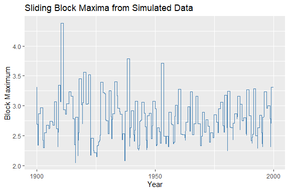
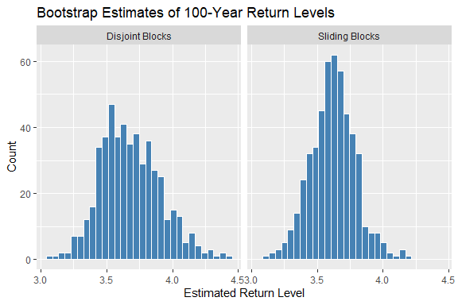

<!-- README.md is generated from README.Rmd. Please edit that file -->

# Welcome to maxbootR

<!-- badges: start -->
<!-- badges: end -->

The `maxbootR` package provides **fast and consistent bootstrap methods
for block maxima**, designed for applications in extreme value
statistics. Under the hood, performance-critical parts are implemented
in C++ via Rcpp, enabling efficient computation even for long time
series.

These methods are based on the first consistent bootstrap approach for
block maxima as introduced in [Bücher & Staud
(2024+)](https://arxiv.org/abs/2409.05529).

## Installation

You can install the development version of `maxbootR` from
[GitHub](https://github.com/) with:

``` r
# install.packages("devtools")
devtools::install_github("torbenstaud/maxbootR")
```

or from
[CRAN](https://cran.r-project.org/web/packages/maxbootR/index.html) in
`R`.

## Quick Example

The following example demonstrates how to extract **sliding block
maxima** from synthetic data.

``` r
library(ggplot2)
library(maxbootR)
library(dplyr)
#> 
#> Attache Paket: 'dplyr'
#> Die folgenden Objekte sind maskiert von 'package:stats':
#> 
#>     filter, lag
#> Die folgenden Objekte sind maskiert von 'package:base':
#> 
#>     intersect, setdiff, setequal, union

# Generate 100 years of daily observations
set.seed(91)
x <- rnorm(100 * 365)

# Extract sliding block maxima with 1-year window
bms <- blockmax(xx = x, block_size = 365, type = "sb")

# Create time-indexed tibble for plotting
df <- tibble(
  day = seq.Date(from = as.Date("1900-01-01"), by = "1 day", length.out = length(bms)),
  block_max = bms
)

# Plot the block maxima time series
ggplot(df, aes(x = day, y = block_max)) +
  geom_line(color = "steelblue") +
  labs(
    title = "Annual Block Maxima from Simulated Data",
    x = "Year",
    y = "Block Maximum"
  ) 
```



## Bootstrap a 100-Year Return Level

We now use the `maxbootr()` function to bootstrap the **100-year return
level** of synthetic data, comparing the disjoint vs. sliding block
bootstrap methods.

``` r
# Set block size (e.g., summer days)
bsize <- 92

# Generate synthetic time series
set.seed(1)
y <- rnorm(100 * bsize)

# Bootstrap using disjoint blocks (+timing)
system.time(
  bst.db <- maxbootr(xx = y, est = "rl", block_size = bsize, B = 500, 
                     type ="db", annuity = 100)
)
#>        User      System verstrichen 
#>        0.64        0.02        0.65

# Bootstrap using sliding blocks (+timing)
system.time(
  bst.sb <- maxbootr(xx = y, est = "rl", block_size = bsize, B = 500, 
                     type = "sb", annuity = 100)
)
#>        User      System verstrichen 
#>        8.13        0.08        8.21

# Compare variance
var(bst.sb) / var(bst.db)
#>           [,1]
#> [1,] 0.5502442
```

The **sliding block method** typically results in **narrower bootstrap
distributions**, reducing statistical uncertainty.

## Visualizing the Bootstrap Distribution



# Learn More

For a full tutorial with real-world case studies (finance & climate),
check out the [vignette](CRAN) included in the package.
